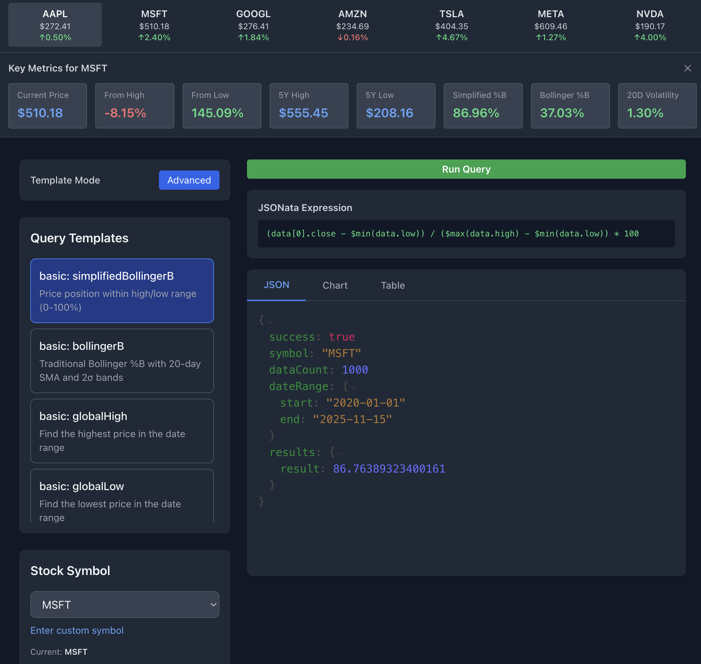

# Stock Watchlist REST API with Historical Data

A comprehensive Node.js REST API for managing stock watchlists and fetching historical stock data, built with Express and SQLite, running entirely in Docker containers. Features hybrid data architecture with Alpha Vantage for historical data and Yahoo Finance (yfinance) for unlimited real-time price checks.



## 📖 Table of Contents

- [🚀 Features](#-features)
- [🏗️ Architecture](#️-architecture)
- [📋 Prerequisites](#-prerequisites)
- [🏁 Getting Started](#-getting-started)
- [🔧 Configuration](#-configuration)
- [📡 API Endpoints](#-api-endpoints)
  - [Current Price API](#current-price-api)
  - [JSONata Query API](#jsonata-query-api)
  - [Legacy Watchlist API](#legacy-watchlist-api)
  - [Historical Data API](#historical-data-api)
  - [Real-time Market Data](#real-time-market-data)
  - [Data Management](#data-management)
- [🧪 Testing the API](#-testing-the-api)
- [📊 Data Overview](#-data-overview)
- [📁 Project Structure](#-project-structure)
- [🔄 Development Workflow](#-development-workflow)
- [🛠️ Docker Commands](#️-docker-commands)
- [🔍 Troubleshooting](#-troubleshooting)

## 🚀 Features

### Core Features
- ✅ Full CRUD operations for stock watchlist
- ✅ SQLite database for data persistence
- ✅ Dockerized development environment
- ✅ Live code reloading with nodemon
- ✅ VS Code debugging support
- ✅ No local Node.js or SQLite installation required

### Historical Data Features
- 📈 **20+ years of historical stock data** (1999-present)
- 🎯 **Magnificent 7 tech stocks** pre-configured (AAPL, MSFT, GOOGL, AMZN, TSLA, META, NVDA)
- 🔄 **Automatic startup refresh** with smart daily caching
- 📊 **Split-adjusted prices** stored in database
- 🏢 **Company overview** and fundamental data
- 📉 **OHLCV data** (Open, High, Low, Close, Volume)
- 🔍 **Flexible date range queries**
- ⚡ **Built-in rate limiting** for API calls
- 🆓 **Free tier support** (25 API calls/day)

### Real-Time Price Features
- 💰 **Unlimited current price checks** via Yahoo Finance (yfinance)
- 🚀 **Separate Python microservice** for price data
- ⚡ **~15 minute delayed data** (no API key required)
- 📊 **OHLCV + detailed quotes** (market cap, PE ratio, 52-week high/low)
- 🔄 **Bulk price fetching** for multiple stocks
- 🏥 **Health checks** and fallback support

### JSONata Query Features
- 🔍 **Declarative querying** with JSONata expressions
- 📊 **Complex aggregations** (min, max, average, count, volatility)
- 🎯 **Pattern detection** (price movements, gaps, trends)
- ⚡ **Multiple queries** in single API call
- 📈 **Advanced analytics** (moving averages, performance metrics)
- 🔢 **Mathematical operations** on historical data
- 📅 **Time-based filtering** with flexible date ranges
- 🎨 **Custom expressions** for any analysis need

## 🏗️ Architecture

### Hybrid Data Architecture

This project uses a two-service microservices architecture to optimize API usage and provide both historical and real-time data:

```
┌─────────────────────────────────────────────────────────────┐
│                       Frontend / Client                      │
└───────────────┬─────────────────────────────────────────────┘
                │
                ▼
┌───────────────────────────────────────────────────────────────┐
│              Node.js Backend (Express + SQLite)               │
│  • Historical data (Alpha Vantage - 25 req/day)              │
│  • JSONata queries on stored data                            │
│  • Startup refresh service (smart daily caching)             │
│  • Split-adjusted prices in DB                               │
└───────────────┬───────────────────────────────────────────────┘
                │
                ├─────────────┐
                ▼             ▼
    ┌───────────────────┐   ┌─────────────────────────────┐
    │  Alpha Vantage    │   │  Python Price Service       │
    │  (Historical)     │   │  (Flask + yfinance)         │
    │  • Daily OHLCV    │   │  • Unlimited requests       │
    │  • 25 calls/day   │   │  • ~15 min delay            │
    │  • Split data     │   │  • No API key needed        │
    └───────────────────┘   └─────────────────────────────┘
```

### Key Benefits

1. **API Budget Management**: Startup refresh checks daily and skips if already done (0 API calls on subsequent restarts)
2. **Split-Adjusted Prices**: Historical prices automatically adjusted for stock splits before storage
3. **Unlimited Current Prices**: Python service scrapes Yahoo Finance with no rate limits
4. **Two-Container Architecture**: Node backend + Python price service with Docker networking
5. **Smart Refresh Logic**: 
   - First startup: 2 API calls per stock (historical data + splits)
   - Subsequent startups same day: 0 API calls (skipped via DB tracking)
   - Manual refresh available when needed

### Daily Workflow

**Morning (First Server Start):**
- Startup refresh checks `last_data_refresh` column
- Fetches updated historical data for stale stocks
- Checks for new stock splits
- Updates DB with split-adjusted prices
- Uses ~2 API calls per stock

**Throughout the Day:**
- Server restarts use 0 API calls (already refreshed)
- Current prices from Python service (unlimited)
- All queries run on local SQLite database

## 📋 Prerequisites

- [Docker Desktop](https://www.docker.com/products/docker-desktop)
- [Visual Studio Code](https://code.visualstudio.com/)
- [Remote - Containers extension](https://marketplace.visualstudio.com/items?itemName=ms-vscode-remote.remote-containers)

## 🏁 Getting Started

### Option 1: Using Dev Containers (Recommended)

1. **Install the Remote - Containers extension** in VS Code
2. **Open this project** in VS Code
3. **Reopen in Container**:
   - Press `Cmd+Shift+P` (macOS) or `Ctrl+Shift+P` (Windows/Linux)
   - Type "Remote-Containers: Reopen in Container"
   - Select the command and wait for the container to build

VS Code will automatically:
- Build the Docker container
- Install all dependencies
- Set up the development environment
- Forward ports 3000 (app) and 9229 (debugger)

### Option 2: Using Docker Compose

```bash
# Build and start the container
docker-compose up --build

# The API will be available at http://localhost:3000
```

## 🔧 Configuration

### Alpha Vantage API Setup

To use historical data and real-time features, you need a free Alpha Vantage API key:

1. **Get a free API key** at [Alpha Vantage](https://www.alphavantage.co/support/#api-key)
2. **Set your API key** in the `.env` file:

```bash
# .env
ALPHA_VANTAGE_API_KEY=your_api_key_here
```

### Environment Variables

The `.env` file contains the following configuration:

```bash
# Alpha Vantage API Configuration
ALPHA_VANTAGE_API_KEY=your_api_key_here

# Magnificent 7 Tech Stocks to track
MAGNIFICENT_7_STOCKS=AAPL,MSFT,GOOGL,AMZN,TSLA,META,NVDA

# Database Configuration  
DATABASE_PATH=./data/stocks.db

# Server Configuration
PORT=3000

# Price Service Configuration (set automatically by Docker Compose)
PRICE_SERVICE_URL=http://price-service:5000
```

## 🐛 Debugging

1. Start the dev container or run `docker-compose up`
2. In VS Code, go to the **Run and Debug** panel (Cmd+Shift+D)
3. Select **"Docker: Attach to Node"**
4. Press F5 or click the green play button
5. Set breakpoints in your code and they'll be hit!

## 📡 API Endpoints

### Health Check

#### Check system health
```bash
GET /health

# Example:
curl http://localhost:3000/health
```

**Response:**
```json
{
  "status": "OK",
  "timestamp": "2025-11-16T19:27:57.829Z"
}
```

### Current Price API

Get real-time stock prices via Python microservice (Yahoo Finance). Unlimited requests, ~15 minute delayed data.

#### Get current price for single stock
```bash
GET /api/stocks/current-price/:symbol

# Example:
curl -s http://localhost:3000/api/stocks/current-price/NVDA | jq
```

**Response:**
```json
{
  "symbol": "NVDA",
  "price": 190.17,
  "open": 182.86,
  "high": 191.01,
  "low": 180.58,
  "close": 190.17,
  "volume": 186591856,
  "timestamp": "2025-11-14 16:00:00"
}
```

#### Get current prices for multiple stocks (bulk)
```bash
POST /api/stocks/current-prices
Content-Type: application/json

{
  "symbols": ["AAPL", "NVDA", "TSLA"]
}

# Example:
curl -X POST http://localhost:3000/api/stocks/current-prices \
  -H "Content-Type: application/json" \
  -d '{"symbols": ["NVDA", "AAPL", "GOOGL"]}' | jq
```

**Response:**
```json
{
  "data": {
    "NVDA": {
      "price": 190.17,
      "open": 182.86,
      "high": 191.01,
      "low": 180.58,
      "close": 190.17,
      "volume": 186591856
    },
    "AAPL": { ... },
    "GOOGL": { ... }
  },
  "errors": {}
}
```

#### Get detailed quote with market info
```bash
GET /api/stocks/current-quote/:symbol

# Example:
curl -s http://localhost:3000/api/stocks/current-quote/AAPL | jq
```

**Response:**
```json
{
  "symbol": "AAPL",
  "price": 272.41,
  "marketCap": 4146285010944,
  "peRatio": 42.15,
  "week52High": 275.96,
  "week52Low": 164.08,
  "avgVolume": 56789012,
  "previousClose": 271.05,
  "change": 1.36,
  "changePercent": 0.50,
  "timestamp": "2025-11-14 16:00:00"
}
```

### JSONata Query API

Execute declarative queries on historical stock data using JSONata expressions. Perfect for complex analysis, pattern detection, and custom aggregations.

#### Get query templates
```bash
GET /api/stocks/query/templates
```

**Example:**
```bash
curl -s http://localhost:3000/api/stocks/query/templates | jq
```

**Response includes:**
- **Basic queries**: globalHigh, globalLow, avgClose, totalVolume
- **Performance**: totalReturn, priceRange, volatility
- **Advanced**: movingAverages, pattern detection
- **Usage examples**: Ready-to-use curl commands

#### Execute single JSONata query
```bash
GET /api/stocks/query/:symbol?expression=JSONATA_EXPRESSION&startDate=YYYY-MM-DD&endDate=YYYY-MM-DD&limit=N

# Examples:
GET /api/stocks/query/NVDA?expression=$max(data.close)&startDate=2020-01-01
GET /api/stocks/query/AAPL?expression=$average(data.volume)
GET /api/stocks/query/TSLA?expression=$count(data)&limit=1000
```

**Example Usage:**
```bash
# Get NVIDIA's highest closing price since 2020
curl -s "http://localhost:3000/api/stocks/query/NVDA?expression=\$max(data.close)&startDate=2020-01-01" | jq

# Count trading days for Apple
curl -s "http://localhost:3000/api/stocks/query/AAPL?expression=\$count(data)" | jq

# Get Tesla's average volume
curl -s "http://localhost:3000/api/stocks/query/TSLA?expression=\$average(data.volume)" | jq
```

**Response Format:**
```json
{
  "success": true,
  "symbol": "NVDA",
  "query": "$max(data.close)",
  "dataCount": 1000,
  "dateRange": {
    "start": "2020-01-01",
    "end": "latest"
  },
  "result": 1224.4
}
```

#### Execute multiple queries (Recommended)
```bash
POST /api/stocks/query/:symbol
Content-Type: application/json

{
  "queries": {
    "queryName1": "JSONATA_EXPRESSION_1",
    "queryName2": "JSONATA_EXPRESSION_2"
  },
  "startDate": "YYYY-MM-DD",
  "endDate": "YYYY-MM-DD",
  "limit": 1000
}
```

**Example - NVIDIA Analysis (Last 5 Years):**
```bash
curl -X POST http://localhost:3000/api/stocks/query/NVDA \
-H "Content-Type: application/json" \
-d '{
  "queries": {
    "globalHigh": "$max(data.high)",
    "globalLow": "$min(data.low)",
    "highestClose": "$max(data.close)",
    "lowestClose": "$min(data.close)",
    "totalReturn": "(data[0].close - data[-1].close) / data[-1].close * 100",
    "priceRange": "$max(data.close) - $min(data.close)",
    "avgVolume": "$average(data.volume)",
    "recordCount": "$count(data)"
  },
  "startDate": "2020-01-01"
}' | jq
```

**Response:**
```json
{
  "success": true,
  "symbol": "NVDA",
  "dataCount": 1000,
  "dateRange": {
    "start": "2020-01-01",
    "end": "latest"
  },
  "results": {
    "globalHigh": 1255.87,
    "globalLow": 86.62,
    "highestClose": 1224.4,
    "lowestClose": 94.31,
    "totalReturn": -40.49,
    "priceRange": 1130.09,
    "avgVolume": 121715895.305,
    "recordCount": 1000
  }
}
```

#### Built-in analysis endpoints

**Global High/Low Analysis:**
```bash
GET /api/stocks/query/:symbol/high-low?startDate=YYYY-MM-DD&endDate=YYYY-MM-DD

# Example: NVIDIA highs and lows since 2020
curl -s "http://localhost:3000/api/stocks/query/NVDA/high-low?startDate=2020-01-01" | jq
```

**Volume Statistics:**
```bash
GET /api/stocks/query/:symbol/volume?startDate=YYYY-MM-DD

# Example: Apple volume analysis
curl -s "http://localhost:3000/api/stocks/query/AAPL/volume?startDate=2023-01-01" | jq
```

**Price Performance Analysis:**
```bash
GET /api/stocks/query/:symbol/performance?startDate=YYYY-MM-DD

# Example: Tesla performance metrics since 2022
curl -s "http://localhost:3000/api/stocks/query/TSLA/performance?startDate=2022-01-01" | jq
```

**Moving Averages:**
```bash
GET /api/stocks/query/:symbol/moving-averages?periods=20,50,200&startDate=YYYY-MM-DD

# Example: Microsoft moving averages
curl -s "http://localhost:3000/api/stocks/query/MSFT/moving-averages?periods=20,50" | jq
```

**Pattern Detection:**
```bash
GET /api/stocks/query/:symbol/patterns?startDate=YYYY-MM-DD

# Example: Google price patterns and large moves
curl -s "http://localhost:3000/api/stocks/query/GOOGL/patterns?startDate=2023-01-01" | jq
```

#### Advanced JSONata Examples

**Find specific price conditions:**
```bash
curl -X POST http://localhost:3000/api/stocks/query/NVDA \
-H "Content-Type: application/json" \
-d '{
  "queries": {
    "bigGainDays": "$count(data[(close - open) / open * 100 > 10])",
    "bigLossDays": "$count(data[(close - open) / open * 100 < -10])", 
    "volatileDays": "$count(data[((high - low) / open * 100) > 15])",
    "greenDaysPercent": "$count(data[close > open]) / $count(data) * 100"
  },
  "startDate": "2020-01-01"
}' | jq
```

**Complex aggregations:**
```bash
curl -X POST http://localhost:3000/api/stocks/query/AAPL \
-H "Content-Type: application/json" \
-d '{
  "queries": {
    "weeklyHigh": "$max(data[0..4].high)",
    "monthlyVolume": "$sum(data[0..21].volume)",
    "priceAbove200": "$count(data[close > 200])",
    "volumeSpikes": "$count(data[volume > $average(data.volume) * 2])"
  }
}' | jq
```

### Legacy Watchlist API

#### Get all stocks
```bash
GET /api/stocks
```

#### Get a single stock
```bash
GET /api/stocks/:id
```

#### Create a new stock
```bash
POST /api/stocks
Content-Type: application/json

{
  "symbol": "AAPL",
  "name": "Apple Inc.",
  "quantity": 10,
  "purchase_price": 150.25,
  "notes": "Tech stock"
}
```

#### Update a stock
```bash
PUT /api/stocks/:id
Content-Type: application/json

{
  "quantity": 15,
  "purchase_price": 155.50
}
```

#### Delete a stock
```bash
DELETE /api/stocks/:id
```

### Historical Data API

#### Get historical stock data
```bash
GET /api/stocks/historical/:symbol?startDate=YYYY-MM-DD&endDate=YYYY-MM-DD&limit=1000

# Examples:
GET /api/stocks/historical/AAPL                    # All available data
GET /api/stocks/historical/AAPL?limit=30           # Last 30 records
GET /api/stocks/historical/TSLA?startDate=2024-01-01&endDate=2024-12-31
```

**Response Format:**
```json
{
  "symbol": "AAPL",
  "count": 5,
  "startDate": "2024-01-01",
  "endDate": "2024-12-31",
  "data": [
    {
      "symbol": "AAPL",
      "date": "2025-11-14",
      "open": 271.05,
      "high": 275.96,
      "low": 269.6,
      "close": 272.41,
      "adjusted_close": 272.41,
      "volume": 47431331,
      "created_at": "2025-11-15 21:35:13"
    }
  ]
}
```

### Real-time Market Data

#### Get current stock quote
```bash
GET /api/stocks/quote/:symbol

# Example:
GET /api/stocks/quote/NVDA
```

**Response Format:**
```json
{
  "data": {
    "symbol": "NVDA",
    "open": 182.86,
    "high": 191.01,
    "low": 180.58,
    "price": 190.17,
    "volume": 186591856,
    "latestTradingDay": "2025-11-14",
    "previousClose": 186.86,
    "change": 3.31,
    "changePercent": "1.7714%"
  }
}
```

#### Get company overview
```bash
GET /api/stocks/overview/:symbol

# Example:
GET /api/stocks/overview/AAPL
```

### Data Management

#### Initialize Magnificent 7 stocks
```bash
POST /api/stocks/init
Content-Type: application/json

{
  "forceRefresh": false
}
```

#### Refresh data for specific stock
```bash
POST /api/stocks/refresh/:symbol
Content-Type: application/json

{
  "fullRefresh": false
}

# Examples:
POST /api/stocks/refresh/AAPL           # Recent data (~100 days)
POST /api/stocks/refresh/TSLA           # Full historical data (20+ years)
```

#### Refresh all tracked stocks
```bash
POST /api/stocks/refresh-all
Content-Type: application/json

{
  "fullRefresh": false
}
```

#### Add custom stock
```bash
POST /api/stocks/add-stock/:symbol
Content-Type: application/json

{
  "name": "Optional Company Name"
}

# Example:
POST /api/stocks/add-stock/NVDA
```

#### Get system information
```bash
GET /api/stocks/summary              # Database statistics
GET /api/stocks/tracked              # All tracked stocks
GET /api/stocks/magnificent-7        # Magnificent 7 list
GET /api/stocks/init/status          # Initialization status
```

## 🧪 Testing the API

### Quick Start Examples

```bash
# 1. Check system health
curl -s http://localhost:3000/health | jq

# 2. Check if API is configured
curl -s http://localhost:3000/api/stocks/init/status | jq

# 3. Initialize Magnificent 7 stocks (first time setup)
curl -X POST http://localhost:3000/api/stocks/init \
  -H "Content-Type: application/json" \
  -d '{"forceRefresh": false}' | jq

# 4. Get database summary
curl -s http://localhost:3000/api/stocks/summary | jq

# 5. Get current price for NVIDIA
curl -s http://localhost:3000/api/stocks/current-price/NVDA | jq

# 6. Get current prices for multiple stocks
curl -X POST http://localhost:3000/api/stocks/current-prices \
  -H "Content-Type: application/json" \
  -d '{"symbols": ["NVDA", "AAPL", "TSLA"]}' | jq

# 7. Get historical data for Apple (last 5 records)
curl -s "http://localhost:3000/api/stocks/historical/AAPL?limit=5" | jq

# 8. Get detailed quote for Tesla
curl -s http://localhost:3000/api/stocks/current-quote/TSLA | jq
```

### JSONata Query Examples

```bash
# Get available query templates
curl -s http://localhost:3000/api/stocks/query/templates | jq

# Simple queries - NVIDIA analysis
curl -s "http://localhost:3000/api/stocks/query/NVDA?expression=\$max(data.close)" | jq
curl -s "http://localhost:3000/api/stocks/query/NVDA?expression=\$min(data.low)&startDate=2020-01-01" | jq

# Built-in analysis endpoints
curl -s "http://localhost:3000/api/stocks/query/NVDA/high-low?startDate=2020-01-01" | jq
curl -s "http://localhost:3000/api/stocks/query/AAPL/performance?startDate=2023-01-01" | jq
curl -s "http://localhost:3000/api/stocks/query/TSLA/volume?startDate=2022-01-01" | jq

# Multiple queries - comprehensive analysis
curl -X POST http://localhost:3000/api/stocks/query/NVDA \
-H "Content-Type: application/json" \
-d '{
  "queries": {
    "globalHigh": "$max(data.high)",
    "globalLow": "$min(data.low)",
    "totalReturn": "(data[0].close - data[-1].close) / data[-1].close * 100",
    "avgVolume": "$average(data.volume)",
    "bigMoveDays": "$count(data[abs((close - open) / open * 100) > 5])"
  },
  "startDate": "2020-01-01"
}' | jq

# Pattern analysis
curl -X POST http://localhost:3000/api/stocks/query/AAPL \
-H "Content-Type: application/json" \
-d '{
  "queries": {
    "greenDays": "$count(data[close > open])",
    "redDays": "$count(data[close < open])",
    "greenPercent": "$count(data[close > open]) / $count(data) * 100",
    "volatileDays": "$count(data[((high - low) / open * 100) > 10])"
  },
  "startDate": "2023-01-01"
}' | jq
```

### Legacy Watchlist API Examples

```bash
# Health check
curl http://localhost:3000/health

# Get all stocks in watchlist
curl http://localhost:3000/api/stocks

# Add a stock to watchlist
curl -X POST http://localhost:3000/api/stocks \
  -H "Content-Type: application/json" \
  -d '{
    "symbol": "AAPL",
    "name": "Apple Inc.",
    "quantity": 10,
    "purchase_price": 150.25
  }'

# Update a stock
curl -X PUT http://localhost:3000/api/stocks/1 \
  -H "Content-Type: application/json" \
  -d '{"quantity": 15}'

# Delete a stock
curl -X DELETE http://localhost:3000/api/stocks/1
```

### Current Price Examples

```bash
# Single stock current price
curl -s http://localhost:3000/api/stocks/current-price/NVDA | jq
curl -s http://localhost:3000/api/stocks/current-price/AAPL | jq

# Bulk current prices
curl -X POST http://localhost:3000/api/stocks/current-prices \
  -H "Content-Type: application/json" \
  -d '{"symbols": ["NVDA", "AAPL", "GOOGL", "MSFT"]}' | jq

# Detailed quote with market info
curl -s http://localhost:3000/api/stocks/current-quote/TSLA | jq
curl -s http://localhost:3000/api/stocks/current-quote/META | jq
```

### Historical Data Examples

```bash
# Get all tracked stocks
curl -s http://localhost:3000/api/stocks/tracked | jq

# Get historical data for different symbols
curl -s "http://localhost:3000/api/stocks/historical/MSFT?limit=3" | jq
curl -s "http://localhost:3000/api/stocks/historical/GOOGL?startDate=2024-01-01&endDate=2024-12-31" | jq

# Get real-time quotes (Alpha Vantage - uses API quota)
curl -s http://localhost:3000/api/stocks/quote/META | jq
curl -s http://localhost:3000/api/stocks/quote/NVDA | jq

# Get company information
curl -s http://localhost:3000/api/stocks/overview/AMZN | jq
```

### Data Management Examples

```bash
# Refresh specific stock data
curl -X POST http://localhost:3000/api/stocks/refresh/AAPL \
  -H "Content-Type: application/json" \
  -d '{"fullRefresh": false}' | jq

# Add a custom stock (e.g., Netflix)
curl -X POST http://localhost:3000/api/stocks/add-stock/NFLX \
  -H "Content-Type: application/json" \
  -d '{"name": "Netflix Inc."}' | jq

# Refresh all tracked stocks
curl -X POST http://localhost:3000/api/stocks/refresh-all \
  -H "Content-Type: application/json" \
  -d '{"fullRefresh": false}' | jq

# Get Magnificent 7 list
curl -s http://localhost:3000/api/stocks/magnificent-7 | jq
```

## � Data Overview

This backend maintains a comprehensive SQLite database with both historical stock data and watchlist functionality:

### Historical Stock Data
- **32,364+ daily records** spanning from 1999 to 2025
- **Magnificent 7 tech stocks**: AAPL, MSFT, GOOGL, AMZN, TSLA, META, NVDA
- **Daily OHLCV data**: Open, High, Low, Close prices and Volume
- **Split-adjusted prices**: Automatically adjusted for stock splits
- **Smart refresh tracking**: Daily refresh checks prevent duplicate API calls
- **Flexible querying**: Date ranges, pagination, and symbol-based filtering

### Real-Time Price Data
- **Unlimited requests**: Python microservice using Yahoo Finance (yfinance)
- **~15 minute delay**: Free tier data, no API key required
- **Bulk fetching**: Get prices for multiple stocks in single request
- **Detailed quotes**: Market cap, PE ratio, 52-week high/low, volume
- **Two-container architecture**: Node backend + Python price service

### Database Statistics
- **Data Range**: January 1999 - January 2025 (20+ years)
- **Update Frequency**: Automatic daily refresh on first startup, 0 API calls on subsequent restarts
- **Data Sources**: Alpha Vantage (historical), Yahoo Finance (current prices)
- **Storage**: Local SQLite database for persistence
- **Performance**: Indexed queries for fast historical lookups
- **Refresh Tracking**: `last_data_refresh` and `last_split_check` columns prevent redundant API calls

### Legacy Watchlist Features
- Track personal stock positions with purchase prices and quantities
- Perform CRUD operations on your watchlist
- Monitor portfolio value changes
- Calculate gains/losses based on current market prices

### Data Structure
```
tracked_stocks: Configured symbols with refresh tracking (last_data_refresh, last_split_check)
historical_stock_data: Daily OHLCV records with split-adjusted prices
stock_splits: Corporate action history for split adjustments
stocks: Personal watchlist entries (legacy feature)
```

## � Environment Variables

Create a `.env` file in the project root:

```env
# Alpha Vantage API Configuration (Required)
ALPHA_VANTAGE_API_KEY=your_api_key_here

# Magnificent 7 Tech Stocks (Optional - uses default if not specified)
MAGNIFICENT_7_STOCKS=AAPL,MSFT,GOOGL,AMZN,TSLA,META,NVDA

# Server Configuration (Optional)
PORT=3000
NODE_ENV=development
```

**Environment Variable Details:**
- `ALPHA_VANTAGE_API_KEY`: **Required** - Get free API key from [Alpha Vantage](https://www.alphavantage.co/support/#api-key)
- `MAGNIFICENT_7_STOCKS`: **Optional** - Comma-separated list of stock symbols to track
- `PORT`: **Optional** - Server port (defaults to 3000)
- `NODE_ENV`: **Optional** - Environment mode (development/production)

## �📁 Project Structure

```
stock-watch-list-rest-node/
├── .devcontainer/
│   └── devcontainer.json           # Dev container configuration
├── .vscode/
│   └── launch.json                 # VS Code debugger configuration
├── src/
│   ├── index.js                    # Application entry point with startup refresh
│   ├── database.js                 # SQLite database setup and schema
│   ├── routes/
│   │   └── stocks.js               # Stock routes and API handlers
│   └── services/
│       ├── alphaVantageService.js      # Alpha Vantage API client
│       ├── dataRefreshService.js       # Historical data operations
│       ├── dataInitService.js          # Magnificent 7 initialization
│       ├── queryService.js             # JSONata query execution
│       ├── splitAdjustmentService.js   # Stock split adjustments
│       ├── startupRefreshService.js    # Automatic daily refresh logic
│       └── priceService.js             # Python price service client
├── price-service/                  # Python microservice for current prices
│   ├── app.py                      # Flask API with yfinance
│   ├── requirements.txt            # Python dependencies
│   └── Dockerfile                  # Python service container
├── data/                           # SQLite database files (auto-created)
│   └── stocks.db                   # Main database file
├── .env                            # Environment variables (create from .env.example)
├── Dockerfile                      # Node.js backend container
├── docker-compose.yml              # Two-service orchestration
├── package.json                    # Node.js dependencies and scripts
├── ARCHITECTURE.md                 # Detailed architecture documentation
└── README.md                       # This documentation
```

## 🔄 Live Reloading

The application uses **nodemon** for automatic reloading. Any changes you make to files in the `src/` directory will automatically restart the server. Just save your file and watch the terminal!

## 💾 Database Persistence

The SQLite database is stored in the `./data` directory, which is:
- Mounted as a volume in Docker
- Persisted between container restarts
- Excluded from git (via `.gitignore`)

## 🛠️ Development Workflow

1. **Make code changes** in VS Code
2. **Save the file** - nodemon will automatically restart the server
3. **Set breakpoints** and debug using F5
4. **Test your API** using curl, Postman, or your browser

## 📦 Docker Commands

```bash
# Build both containers (Node + Python)
docker-compose build

# Start all services
docker-compose up

# Start in detached mode
docker-compose up -d

# Stop all services
docker-compose down

# View logs for all services
docker-compose logs -f

# View logs for specific service
docker-compose logs -f app           # Node backend
docker-compose logs -f price-service # Python service

# Restart specific service
docker-compose restart app
docker-compose restart price-service

# Check service health
curl http://localhost:3000/health        # Node backend
curl http://localhost:5001/health        # Python price service

# Rebuild from scratch
docker-compose down
docker-compose build --no-cache
docker-compose up
```

## 🔍 Troubleshooting

### API Key Issues
```bash
# Check if API key is configured
curl -s http://localhost:3000/api/stocks/init/status | jq

# Verify API key works
curl -s "https://www.alphavantage.co/query?function=GLOBAL_QUOTE&symbol=AAPL&apikey=YOUR_API_KEY"
```

**Common API Issues:**
- `Missing API key`: Set `ALPHA_VANTAGE_API_KEY` in `.env`
- `Rate limit exceeded`: Free tier allows 25 requests/day
- `Invalid symbol`: Check stock symbol is correct (e.g., GOOGL not GOOGLE)
- `Network timeout`: Alpha Vantage API can be slow, wait and retry

### JSONata Query Issues
```bash
# Test query templates first
curl -s http://localhost:3000/api/stocks/query/templates | jq

# Verify data exists for symbol
curl -s "http://localhost:3000/api/stocks/historical/NVDA?limit=1" | jq

# Test simple expression
curl -s "http://localhost:3000/api/stocks/query/NVDA?expression=\$count(data)" | jq
```

**Common JSONata Issues:**
- `Syntax error`: Check JSONata expression syntax (use $ for functions)
- `No data found`: Ensure stock symbol has historical data loaded
- `URL encoding`: Use POST with JSON body for complex expressions
- `Type errors`: Ensure operations are on correct data types (numbers vs strings)

**JSONata Expression Examples:**
```bash
# Correct syntax
"$max(data.close)"              # ✅ Get maximum close price
"$count(data[close > open])"    # ✅ Count green days
"(data[0].close - data[-1].close) / data[-1].close * 100"  # ✅ Total return

# Common mistakes  
"max(data.close)"               # ❌ Missing $ prefix
"$count(data.close > open)"     # ❌ Wrong filter syntax
```

### Port already in use
If port 3000 or 9229 is already in use, modify the ports in `docker-compose.yml`:
```yaml
ports:
  - "3001:3000"   # Use port 3001 on your host
  - "9230:9229"   # Use port 9230 for debugging
```

### Container won't start
```bash
# Check Docker logs
docker-compose logs

# Rebuild the container
docker-compose down
docker-compose build --no-cache
docker-compose up
```

### Database issues
```bash
# Check initialization status
curl -s http://localhost:3000/api/stocks/init/status | jq

# Get database summary
curl -s http://localhost:3000/api/stocks/summary | jq

# Reset database (WARNING: Deletes all data)
rm -rf data/
docker-compose restart
```

### Historical Data Issues
```bash
# Check if data exists for a symbol
curl -s "http://localhost:3000/api/stocks/historical/AAPL?limit=1" | jq

# Manual refresh specific stock
curl -X POST http://localhost:3000/api/stocks/refresh/AAPL \
  -H "Content-Type: application/json" \
  -d '{"fullRefresh": true}' | jq

# Re-initialize all Magnificent 7 stocks
curl -X POST http://localhost:3000/api/stocks/init \
  -H "Content-Type: application/json" \
  -d '{"forceRefresh": true}' | jq
```

### Price Service Issues
```bash
# Check if price service is running
curl -s http://localhost:5001/health | jq

# Test single stock price
curl -s http://localhost:3000/api/stocks/current-price/AAPL | jq

# Check Docker containers status
docker-compose ps

# Restart price service if needed
docker-compose restart price-service
docker-compose logs -f price-service
```

**Common Price Service Issues:**
- `Service unavailable`: Ensure both containers are running with `docker-compose ps`
- `Network timeout`: Price service may be slow, wait and retry
- `Empty data`: Market closed or symbol invalid
- `Connection refused`: Check containers can communicate (networking issue)

### Startup Refresh Issues
```bash
# Check last refresh timestamps
curl -s http://localhost:3000/api/stocks/tracked | jq

# View startup logs
docker-compose logs app | grep "refresh"

# Force manual refresh if needed
curl -X POST http://localhost:3000/api/stocks/refresh-all \
  -H "Content-Type: application/json" \
  -d '{"fullRefresh": false}' | jq
```

**Smart Refresh Logic:**
- First startup of the day: Uses 2 API calls per stock (historical + splits)
- Subsequent startups same day: Uses 0 API calls (skipped)
- Next day: Automatically refreshes stale data
- Check `last_data_refresh` column in `tracked_stocks` table

## 📝 License

ISC

## 🤝 Contributing

Feel free to submit issues and pull requests!
